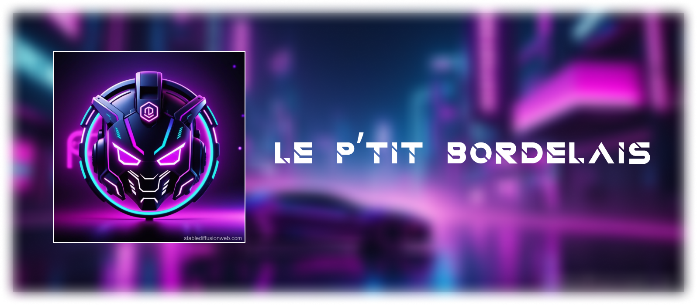

---

    

# BOT DISCORD Le P'tit Bordelais 

## 🔍 Retrieving the LPB bot image for Docker
You can find the LPB bot image for Docker ➡️  [](https://hub.docker.com/repository/docker/lzerteur/lpb/).

## 🐳 Docker Run Command
To run the bot with Docker, execute the following command:
```
docker run -e BOT_TOKEN=<YOUR_TOKEN_IN_PLAINTTEXT> -e DISCORD_CHANNEL_ID=<YOUR_ID_CHANNEL_IN_PLAINTTEXT> -d --name lpb-dockerized lzerteur/lpb:<TAG>
```

⚠️ The DISCORD_CHANNEL_ID will be the channel used for some logs such as when the bot is restarted

## 🐳 Docker Compose Configuration
Alternatively, you can use Docker Compose. Add the following to your `docker-compose.yml` file:
```
version: '3.8'
services:
  bot:
    image: lzerteur/lpb:<TAG>
    container_name: lpb-dockerized
    environment:
      - BOT_TOKEN=<YOUR_TOKEN_IN_PLAINTTEXT>
      - DISCORD_CHANNEL_ID=<YOUR_ID_CHANNEL_IN_PLAINTTEXT>
    restart: unless-stopped
```

## 💬 Command Guide
If you want to interact with the bot, here are the available commands:

=======
- 🌉 | `/pont` : Display upcoming bridge openings
- 👤 | `/fakeid` : Generate a fake identity
- 🤬 | `/insulte` : Generate a more or less polite insult
- 🗣️ | `/addinsulte [insulte]` : Add an insult to the list
- 🚀 | `/nasa` : Send a random image from NASA
- 🌍 | `/earth` : Send a random image of Earth
- 🔫 | `/roulette` : Play a game of Russian roulette... beware, if you lose, you get kicked!

For more information, type:
```
ℹ️ | /aide : Display this menu
```


---

# Manual installation (not recommended unless for developement) :wrench: :

Before every install step, download the git repo with

```git clone https://github.com/Oneloutre/le-ptit-bordelais.git```

Then, when it's done, create a file named `.env`

In this file, simply write `BOT_TOKEN="'OUR BOT TOKEN'` and of course, replacing "YOUR BOT TOKEN" with... Your token. It makes sense, right ?
Don't forget to add `DISCORD_CHANNEL_ID=YOUR DEV CHANNEL ID` for the channel where some actions such as restarts will be logged.

This step is useful, in particular if you use docker since the prompt won't show.
### Using Python :snake: directly :

Go in your folder using `cd le-ptit-bordelais` and then :

Execute `pip install -r requirements.txt` then `python main.py`

:warning: make sure that you're using Python **3.12** !

### Using Docker :whale: :

Execute `docker build -t le-ptit-bordelais .` then `docker run -d le-ptit-bordelais`

Enjoy interacting with LPB bot! 🤖


# Special thanks :heart: :

Thanks to [Lzerteur](https://github.com/Lzerteur) for the Dockerization of the bot and the help with the README.md file.
